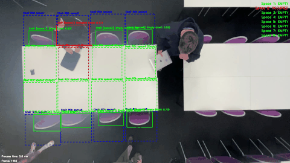
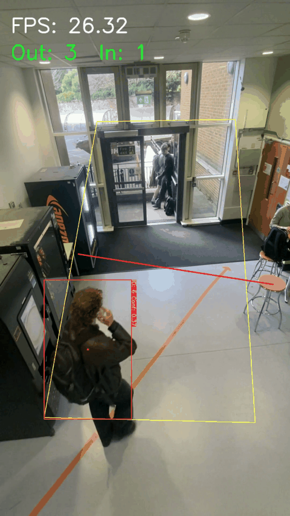

# 🎓 Campus Occupancy Detection System

A real-time, computer vision-based system for monitoring occupancy in university libraries and study spaces.  
Developed as part of the **MDM3 module** at the University of Bristol, Engineering Mathematics.

This repository contains a computer vision-based system for monitoring occupancy in university libraries and study spaces.  
The system uses a combination of deep learning techniques to accurately detect and track occupancy in real-time.

---

## 📸 Introduction to Computer Vision for Occupancy Monitoring

Computer vision offers powerful tools for understanding and analyzing space utilization without requiring physical sensors at each seat.  
Our approach combines traditional computer vision techniques with modern deep learning to create a robust, privacy-conscious monitoring system that provides valuable insights into how campus spaces are utilized.

---

## 🔑 Key Features

- 🎯 Real-time occupancy detection using multiple computer vision techniques  
- 🔐 Privacy-preserving implementation that doesn't store identifiable images of individuals  
- 🪑 ROI (Region of Interest) system for monitoring specific seats and desk areas  
- 🌙 Image-enhancing techniques for improved detection in low lighting  
- 📈 Kalman filter for sophisticated tracking of moving targets  
- 🧠 Fine-tuned YOLO on a custom dataset for increased chair detection accuracy  

---

## 🪑 Seat Monitoring Methodology

We use a **triple-check system** to determine whether a seat is occupied:

1. ✅ **Person Detection** — Identifies the presence of a person in the chair location  
2. 🧳 **Desk Possessions** — Detects objects left on the desk surface  
3. 🎒 **Chair Possessions** — Identifies belongings left on the chair (e.g. backpacks, jackets)

If **any one** of these conditions is met, the seat is classified as **occupied**.


---

## 🧍 People Counting Methodology

Effective people counting faces two primary challenges:

- 🎯 **Tracking moving targets**
- 🔄 **Maintaining live, consistent counts without missing entries/exits**

To overcome this, we employ a **Kalman filter**, which predicts the future location of a detected person’s **centroid** in the next frame.  
This improves the consistency of tracking and reduces errors from temporary occlusions or brief tracking loss.

### 📘 What is a Kalman Filter?

A **Kalman filter** is an algorithm that uses a series of measurements observed over time — even if they contain noise or are incomplete — to produce more accurate estimates of unknown variables.  
In our system, it predicts the **future position** of a detected person based on past movement, helping maintain consistent ID tracking between frames.




---

## ⚙️ Prerequisites

- Python 3.8+  
- OpenCV 4.5+  
- NumPy  
- PyTorch (for YOLO models)  

---

## 🧪 Installation

```bash
# Clone the repository
git clone https://github.com/yourusername/campus-occupancy.git
cd campus-occupancy

# Install dependencies
pip install -r requirements.txt

# Download pre-trained models
python download_models.py
